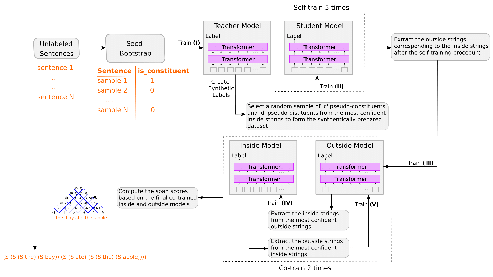

<div align="center"> 
    
# Co-training an Unsupervised Constituency Parser with Weak Supervision

[](https://arxiv.org/abs/2110.02283)
[](https://github.com/Nickil21/weakly-supervised-parsing/actions/workflows/ci-testing.yml)
[](https://codecov.io/gh/Nickil21/weakly-supervised-parsing/)
[](https://paperswithcode.com/sota/constituency-grammar-induction-on-ptb?p=co-training-an-unsupervised-constituency)
    


</div>

## Table of Contents

   * [Installing dependencies](#installing-dependencies)
   * [Train](#train)      
   * [Inference](#inference)
   * [Evaluation](#evaluation)
   * [Tests](#tests)

## Installing dependencies

Clone the project:

```shell
git clone https://github.com/Nickil21/weakly-supervised-parsing
cd weakly-supervised-parsing/
```

Create virtual environment:

```shell
python3.8 -m venv weak-sup-parser-env # or other python versions >=3.8
source weak-sup-parser-env/bin/activate
```

Install the requirements

```shell
pip install -r requirements.txt
``` 

## Processing PTB

Set the `NLTK_DATA` variable to allow nltk to find the corpora and resources you downloaded with `nltk.download()`:

```shell
export NLTK_DATA=./data/RAW/english/
python -m nltk.downloader ptb
```

Download the PTB 3.0 file:

```shell
wget <PATH_TO_PTB_3_ZIP_FILE>
```

Unzip the zip file, extract the contents inside the `data/` folder, and delete the original zip file:

```shell
unzip ptb3.zip -d ./TEMP/ && rm ptb3.zip

cp -r ./TEMP/ ./data/RAW/english/
mkdir ./data/RAW/english/corpora/ptb/TEMP/
mv ./data/RAW/english/TEMP/corrected/ ./data/RAW/english/corpora/ptb/TEMP/
```

Download the following files from [here](https://drive.google.com/file/d/1m4ssitfkWcDSxAE6UYidrP6TlUctSG2D/view) and place them inside `./data/PROCESSED/english/Yoon_Kim/`:

    ptb-train-gold-filtered.txt
    ptb-valid-gold-filtered.txt
    ptb-test-gold-filtered.txt

To process PTB:

```shell
python parser/utils/process_ptb.py
```

Delete the unnecessary PTB files inside the `TEMP/` folder:

```shell
rm -rf ./TEMP/corrected/
```

## Train

```shell
export MODEL_PATH=weakly_supervised_parser/model/TRAINED_MODEL
export TRAIN_SENTENCES_PATH=./data/PROCESSED/english/sentences/ptb-train-sentences-without-punctuation.txt

python weakly_supervised_parser/train.py \
    --path_to_train_sentences ${TRAIN_SENTENCES_PATH} \
    --model_name_or_path roberta-base \
    --output_dir ${MODEL_PATH} \
    --max_epochs 10 \
    --lr 5e-6 \
    --train_batch_size 32 \
    --eval_batch_size 32 \
    --num_workers 16 \
    --inside_max_seq_length 256 \
    --outside_max_seq_length 64 \
    --num_labels 2 \
    --num_self_train_iterations 5 \
    --num_co_train_iterations 2 \
    --upper_threshold 0.995 \
    --lower_threshold 0.005 \
    --num_train_rows 100 \
    --num_valid_examples 100 \
    --seed 42
```

## Inference

```shell
python weakly_supervised_parser/inference.py \
    --use_inside \
    --model_name_or_path roberta-base \
    --inside_max_seq_length 256 \
    --save_path <FILENAME>
```

## Evaluation

```shell
python weakly_supervised_parser/tree/compare_trees.py --tree2 <FILENAME>             
```

## Tests

```shell
pytest weakly_supervised_parser/tests --disable-pytest-warnings
```
    
## Citation

If you find our paper and code useful in your research, please consider citing:

```bibtex
@misc{maveli2022cotraining,
        title={Co-training an Unsupervised Constituency Parser with Weak Supervision}, 
        author={Nickil Maveli and Shay B. Cohen},
        year={2022},
        eprint={2110.02283},
        archivePrefix={arXiv},
        primaryClass={cs.CL}
}
```
